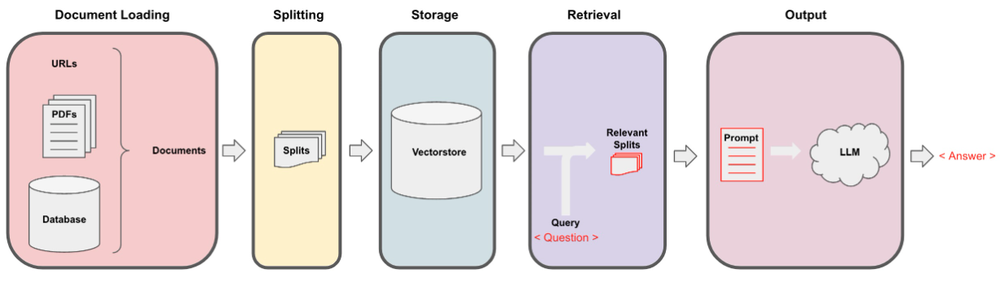

# VerAIzon
RAG (Retrieval Augmented Generation) chatbot accompanied with Mistral-7B, specifically tailored for Verizon customer services.

# ChatBot procedure




## Dataset
Data was gathered through the iterative extraction using the data_extraction.py file. The code intially begins with just 2 links - ['https://www.verizon.com/home/internet/','https://community.verizon.com/'] and then at run-time it scrapes all the links in these two web-pages and this process goes on, creating about a dataset of 1000 pages. Another source of data are the user-guides available at https://www.verizon.com/about/terms-conditions/user-guides.

## Splitting
LLMs cannot process the whole data and thus we need to split the data into small portions of texts. The Dataset was splitted into small chunks using recursive character splitting from langchain. Once we have the small chunks we can create its embeddings using all-MiniLM-L12-v2 model via huggingface embeddings.

## Storage
Once we have the embeddings corresponding to the textual chunks, we can store it in a vector database. For our purpose, we used the FAISS (Facebook AI similarity Search) vectorstore as it is highly effecient when calculating similarity over huge amount of data.

## Retrieval
For the retrieval part we take the user question as an input and find the most matching chunks stored in the vectorstore using the FAISS search that could potentially answer the user query.

## Output
Once we have our most matching chunks we can label them as context and pass them onto the custom prompt for our model. For out purpose we used the following prompt -
```py
[INST] You are a Verizon company's chatbot, Only use the following pieces of context to answer the user's question. If the answer is not present in context, just say that you don't know and display the following link "https://www.verizon.com/support/residential/contact-us/contactuslanding.htm", don't try to make up an answer.[/INST]

        Context: {context}
        Question: {question}
        answer: 
```
Now this prompt is passed to the LLM in order to get the output. The LLM that we used is Mistral-7B (Current Open-Source State of the Art).

# Run the bot - 
## Jupyter Notebook
1. Git clone this repository.
2. Change the db paths in jupyter notebook.
3. Run the cells.

## Python files
1. Git clone this repository.
2. change the db paths in .py files.
3. First run ingest.py followed by model.py file.

# Our System Specification

1. 48 GB RAM
2. A100 40 GB vRAM